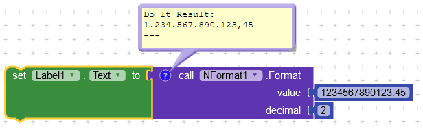
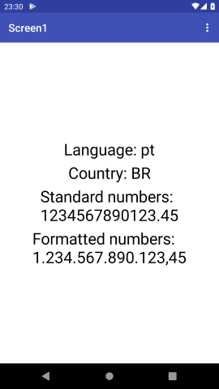
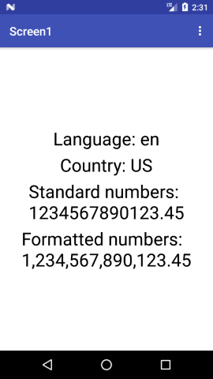

# NFormatAIX
Mit AppInventor / Kodular extension format numbers based on default system language and country. Value is double (**max 15 digit numbers**). Decimal is int.

## Example

## Screenshots

- In Portuguese Brazil

- In English USA

